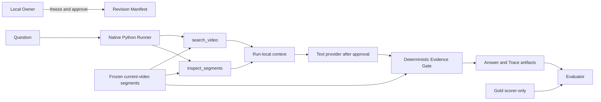

# P1 System Design

## 1. Context and trust boundary



Trusted boundary: local Python validation, frozen manifests, segment store, Tool executor,
Evidence Gate and scorer. Untrusted inputs: question text, transcript content as prompt data,
provider action/proposal, manually drafted candidate. Gold is authoritative only for scoring and
must never enter retrieval/provider context.

## 2. Components and responsibilities

| Component | Responsibility | Source of truth / invariants | Links |
| --- | --- | --- | --- |
| Baseline freezer | snapshot HEAD, uv.lock, questions, Gold, segments, P0 report | immutable hashes | REQ-P1-008 |
| Headroom builder | candidate provenance and pre-freeze | candidate manifest | REQ-P1-001/013 |
| B1 runner | one fixed search + P0 answer contract | same initial evidence budget as B2 | REQ-P1-002 |
| Tool executor | validate/read current video only | `segments.jsonl`, Top-K=5, max calls=3 | REQ-P1-003/006 |
| B2 controller | bounded model decisions | Native Python state + Trace | REQ-P1-004/007 |
| Evidence Gate | validate proposal and hydrate source evidence | authoritative VideoSegment | REQ-P1-005/006/012 |
| Evaluator | compare B1/B2 and calculate H4 | frozen Gold/rubric; no answer generation | REQ-P1-002/010 |
| Artifact writer | atomic new-revision files and manifests | append-oriented local filesystem | REQ-P1-008 |

No UI, API server, queue, worker, database, multi-agent service, VLM path or framework runtime is
allowed. The flow is synchronous per question. Formal evaluation may iterate questions
sequentially; application and provider concurrency are both 1.

## 3. Primary flow and control precedence

```text
manifest/hash validation
  > provider-authorization check
  > deterministic initial search
  > bounded model action
  > Tool argument/scope/budget validation
  > read-only Tool execution
  > final schema validation
  > provenance Evidence Gate
  > scoring and Owner review
```

Provider output cannot bypass any earlier rule. Runtime state wins over CLI text/provider status;
manifest hashes win over mutable file names. A source hash drift stops before provider use. Tool
failure is isolated to the current run. A formal revision with any provider/schema/runtime failure
is preserved and excluded from H4 as invalid, not silently repaired.

## 4. Configuration, secrets and environments

- Toolchain: existing Python `>=3.12,<3.13`, project `.venv`, uv, committed `uv.lock`.
- Local environments: `offline-dev` for fixtures/tests; `formal-local` for later approved provider
  evaluation. No cloud deployment.
- Existing environment variable names: `OPENAI_API_KEY`, `OPENAI_BASE_URL`,
  `VIDEO_EVIDENCE_MODEL`; record credential presence only. Secrets remain in local untracked env.
- Revision manifest must snapshot non-secret provider/model identifiers, prompt/tool/policy/source
  versions, question/Gold hashes and budgets.
- Config precedence for formal run: frozen manifest > validated CLI arguments > environment for
  secret resolution. Environment may not change a frozen model/base URL identifier silently.

## 5. Scaling, failure isolation and recovery

Workload is at most 16 questions × 2 methods, sequentially, one active provider request. There is
no backpressure queue; a second formal process on the same revision must be rejected by revision
lock/preflight. Tool calls are local and bounded to 3 per B2 run. Saturation is budget exhaustion,
provider timeout, or duplicate run ID, each fail-closed.

Artifacts must be written atomically into a new revision path, with manifest/content hashes.
Temporary files are not official until manifest commit. No backup service is required for G1;
Git-tracked contracts plus immutable local result directories are the accepted single point of
failure. Recovery from process/device loss creates a new revision from frozen inputs; it never
continues or overwrites a formal run.

## 6. Allowed envelope and rejected alternatives

- Fixed: Native Python bounded loop, two Tool contracts, P0 answer schema, local file artifacts.
- Implementation-delegated: module/function names and internal decomposition that stay within
  public schemas, existing dependency policy and tests.
- Prohibited: LangGraph, Hypha, VLM, new framework, DB/queue/server, arbitrary time ranges, model-
  selected Top-K, cross-video access, model-provided quote/timestamp, hidden retry.
- Rejected rationale: graph/framework/persistence add no capability required by a single short
  read-only run and would confound the B1/B2 experiment. VLM would restore an absent B0 and change
  modality, cost and evidence source.

## 7. Release and rollback

P1 construction must land in vertical slices behind an internal experimental CLI path or module
entry; existing P0 commands/contracts remain compatible. No schema/data migration is permitted.
Rollback means stop invoking/removing the experimental B2 path while retaining manifests and
results. `DELETE_AGENT` explicitly authorizes a later removal task, but deletion of code still
requires separate implementation authorization; historical evidence remains.

