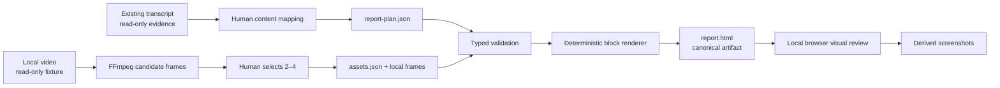

# Video Visual Report V0 — System Design

## Design drivers

1. Visual quality is the product hypothesis; automation is deliberately absent.
2. The LLM-independent contract is content semantics, not page geometry.
3. One renderer must serve browser reading and later screenshot export.
4. Content and media lifecycles stay separate and source-traceable.
5. V0 must remain a small local extension beside, not inside, frozen P0-B Eval.

## Existing-system baseline and real runtime path

The baseline at design time is branch `visual-report`, commit
`fc9b29ce387f52d5da92be8fc68ce171727f872a` (`p0b-stable`). The repository uses
Python 3.12, uv, Pydantic, FFmpeg/ffprobe, and existing `VideoSegment` JSONL.
The V0 renderer reads the existing transcript as authoring evidence but does not
call retrieval, answering, Evidence Gate, P0-B evaluation, ASR, or any model.

## Context and trust boundaries

The trusted boundary is the local repository and artifact directory. Authored
JSON is treated as untrusted input for HTML escaping and path resolution. There
is no external system boundary or network dependency.

## Components and responsibilities

| Component | Responsibility | Requirements | Trust/data boundary |
|---|---|---|---|
| `plan_models` | Versioned report, section, block, and source-ref contracts | `REQ-VR0-001`, `002`, `007`, `008` | Untrusted JSON → validated objects |
| `asset_models/resolver` | Validate asset metadata, containment, readability, timestamps | `REQ-VR0-003`, `008`, `011` | Untrusted manifest/path → bounded local file |
| `components` | Render structural and seven typed content components | `REQ-VR0-002`, `004`, `006`, `009`, `010` | Validated content only |
| `document_renderer` | Compose semantic HTML, dense editorial design tokens, footer, responsive CSS | `REQ-VR0-004`, `005`, `009`, `010` | Pure/deterministic composition |
| `svg` | Renderer-owned process and spine geometry | `REQ-VR0-004`, `006` | No plan coordinates or SVG paths |
| `cli/__main__` | Parse paths, orchestrate validate/render/write, report errors | `REQ-VR0-001`, `005`, `008` | Local command boundary |
| Browser review | Inspect desktop/mobile output and capture screenshots | `REQ-VR0-013`, `014` | Human visual gate |

Names are descriptive, not a mandate for excess files. The implementer chooses
the smallest module split that keeps contracts testable.

## Main execution flows

### Render flow

1. Parse CLI paths.
2. Read plan and asset JSON as UTF-8.
3. Validate supported versions, fields, IDs, list budgets, source boundaries,
   asset references, path containment, and file readability.
4. Render each block through a closed type-to-component mapping.
5. Compose one semantic document with local CSS and renderer-owned inline SVG.
6. Write a sibling temporary output and replace the target only on success.
7. Print report ID, section/block/asset counts, and output path.

### Content authoring flow

The implementer reads the timestamped transcript and frames, selects the thesis
and story, authors the plan, validates, and iterates. Report content is edited in
JSON, not directly in HTML. Topic coverage and report selection are performed
manually but conceptually remain separate so future automation cannot merge
their responsibilities.

### Visual review flow

Open the final HTML locally, inspect a 1080 px desktop viewport and about 390 px
mobile viewport, capture full-page screenshots, critique hierarchy/rhythm/type/
image treatment/overflow, then repeat the render loop until the implementation
acceptance rubric passes.

## User workflow, control/administration, data/source, execution, and operations planes

- **User plane:** local HTML reading and owner review.
- **Control plane:** CLI arguments and validated JSON; no admin UI.
- **Data/source plane:** read-only P0-B transcript/media plus local V0 artifacts.
- **Execution plane:** one foreground Python process.
- **Operations plane:** command/test outputs, screenshots, task/status documents.

No plane requires a server, database, queue, credentials, analytics, or runtime
model.

## Synchronous and asynchronous boundaries

All V0 work is synchronous. FFmpeg frame extraction, rendering, and screenshots
are explicit foreground steps. No worker, polling, callback, event bus, retry
loop, or partial background result is introduced.

## State authority and external-status mapping

The durable project state is `docs/visual-report/V0-STATUS.md`; the plan and asset
manifest own report data; renderer source owns layout. There is no external
status. Artifact existence never implies owner acceptance.

## Required logical architecture, invariants, and allowed solution envelope

- Closed discriminated block union; no dynamic plugins.
- Assets separate from content; blocks reference IDs only.
- Renderer decides all visual geometry and style.
- Hero and Section Header are structural, derived from top-level/section data.
- Only process flow requires programmatic inline SVG.
- Semantic HTML and CSS are preferred over drawing text into a canvas.
- No generated timestamp or random ID that makes identical input nondeterministic.
- Escape content at the rendering boundary.
- No external URL requests in HTML.
- One fixed theme, one canonical output, no second PNG/PDF implementation.

## Fixed/delegated technology decisions and alternatives

| Area | Decision | Why | Rejected for V0 |
|---|---|---|---|
| Runtime | Existing Python/Pydantic project | Reuses environment and typed validation | New JS app/toolchain |
| Markup | HTML/CSS + limited inline SVG | Best first path for typography, responsiveness, screenshot export | Canvas, slide/PDF-first renderer |
| Templates | Small project-owned rendering functions/templates | Deterministic and dependency-light | Free-form generated HTML, plugin system |
| Layout | CSS flow/grid plus renderer SVG rules | Natural height and stable responsive behavior | LLM coordinates/free canvas |
| Assets | Relative local files from manifest | Easy inspection/reuse | Base64 duplication, remote storage |
| Review | Local browser screenshots | Direct evidence of actual visual output | Tests-only visual claim |

The implementer may choose internal function/file names and whether to use
standard-library string composition or an already-installed safe templating
facility. A new template dependency is not justified unless an observed failure
cannot be solved within the existing environment.

## Deployment topology and environments

One local macOS checkout and browser. The artifact is opened from disk or a
minimal local static server solely for inspection. No cloud, staging, production,
container, CI deployment, or public URL is in scope.

## Scaling, load control, and backpressure

One report, one plan, 2–4 used images, and one synchronous process. Backpressure,
queues, distributed work, caching, and concurrency controls are not applicable.
The fixed render should complete within five seconds on the owner's current Mac;
ten seconds is the investigation threshold rather than a service SLO.

## Failure isolation and recovery

Validation precedes output replacement. Unknown data never falls back to a
generic component. A failed render leaves the prior valid artifact intact when
practical and records a non-zero result. Recovery is an explicit correction and
rerun. P0-B inputs remain read-only, isolating V0 failures from stable evidence.

## Configuration, secrets, release, rollback, backup, and restore

- Configuration: schema versions, CLI paths, and project-owned design tokens.
- Secrets: none.
- Release: owner visual acceptance after implementation stops for review.
- Rollback: version-control source/plan changes or rerender a retained prior plan.
- Backup/restore: no service requirement; artifact can be regenerated from local
  plan/assets/source. Do not change protected P0-B backups or evidence.
