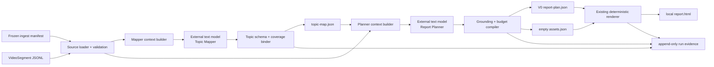

# Video Visual Report V1-A — System Design

## Design drivers

1. Content planning, not rendering, is the active product uncertainty.
2. Coverage and editorial compression optimize different objectives and remain
   separate model calls.
3. Models select semantic content and existing source IDs; deterministic code
   owns identity, timestamps, validation, budgets, and renderer compatibility.
4. Every failure remains visible and no semantic auto-repair obscures model quality.
5. Existing V0 renderer and frozen P0-B inputs remain isolated and unchanged.

## Context and trust boundary

The local process is trusted to validate source/config and hold credentials.
Transcript and provider output are untrusted data. The provider receives the
authorized transcript and task contract but no secret, local path, media, tool,
or execution authority.

## Components and responsibilities

| Component | Responsibility | Must not do |
|---|---|---|
| Source loader | Reuse `VideoSegment`/manifest validation; enforce size and rights metadata | Rewrite or resegment frozen transcript |
| Run recorder | Create unique directory; snapshot non-secret config; record state/calls/failures | Overwrite another run or hide failure |
| Mapper context builder | Serialize complete ordered transcript plus Mapper schema/policy | Retrieve, rank, truncate silently, or add outside facts |
| Model adapter | Execute one explicit provider call and capture usage/latency/raw output | Retry, fall back, call tools, or choose an implicit model |
| Topic binder | Validate closed proposal, account for segments, generate IDs/times | Repair summaries or decide report importance |
| Planner context builder | Provide full transcript, canonical Topic Map, renderer grammar/budgets | Remove mapped topics before model sees them |
| Plan compiler | Validate topic selection/grounding/budgets; generate current V0 plan and empty assets | Rewrite claims or modify renderer layout |
| V0 renderer | Render the compiled current plan | Call a model or interpret missing fields |
| Evaluation harness | Aggregate deterministic metrics and human review cards across all six runs | Rescore selectively or call failures successes |

Names are logical responsibilities, not a mandate for one file per row.

## Main synchronous flow

1. Reject an existing run ID and create `run.json` in state `CREATED`.
2. Load manifest/segments; validate video identity, temporal invariants, size,
   explicit provider/model, and credential presence.
3. Make the Topic Mapper call with the entire ordered transcript.
4. Persist raw output; validate, account for all segments, bind exact refs, and
   write `topic-map.json`.
5. Make the Report Planner call with the same transcript, canonical Topic Map,
   block affordances, and budgets.
6. Persist raw output; validate topic decisions/source IDs/content budgets;
   compile deterministic IDs/timestamps/metadata into the current V0 plan.
7. Write the current empty asset manifest and call the existing renderer.
8. Confirm exactly two admitted calls and complete artifacts; mark `RENDERED`.
9. Measurement code later scores the run; runtime never self-accepts quality.

## Authority map

| Concept | Canonical authority | Derived representation | Conflict rule |
|---|---|---|---|
| Transcript text/IDs/times | Existing `segments.jsonl` | Model context, source refs | Source artifact wins; unknown/mismatched ID fails |
| Video metadata/rights | Existing ingest/corpus manifest | Report metadata/run manifest | Manifest wins; model cannot author it |
| Topic coverage | Valid canonical `topic-map.json` | Planner context | Binder result wins; raw proposal is diagnostic |
| Report semantics/order | Valid compiled `report-plan.json` | Rendered DOM | Compiled plan wins; do not hand-edit HTML |
| Layout/style | Existing renderer source | HTML/CSS | Renderer wins; model fields rejected |
| Run status | Run-local `run.json` | Artifact existence/stdout | Status guard wins; files alone do not imply success |
| Measurement conclusion | Owner-approved evaluation report | Per-run metrics | Owner decision wins; renderer success is insufficient |

## Model and deterministic responsibility

| Decision | Topic Mapper | Report Planner | Deterministic code |
|---|---|---|---|
| What the transcript covers | Proposes complete ordered topics | Reads only | Accounts every segment, binds times |
| What to emphasize/omit | Prohibited | Proposes explicit selection | Validates every topic disposition |
| Narrative/section/block type | Prohibited | Proposes semantic structure | Enforces closed grammar/budgets |
| Claim wording | Topic summaries only | Report copy | Validates refs/metrics; never rewrites |
| IDs/timestamps/metadata | Prohibited | Prohibited | Sole authority |
| HTML/CSS/SVG/layout | Prohibited | Prohibited | Existing renderer only |

## Technology and framework choices

- Existing Python/Pydantic/uv contracts are fixed by the repository.
- The already-installed OpenAI SDK remains the provider boundary; the exact
  configured text model is explicit per run and Owner-confirmed as an
  implementation-delegated choice within context/JSON/quality constraints.
- Framework status is `NOT_APPLICABLE`; two sequential calls plus deterministic
  validators do not justify an Agent framework, workflow engine, or Hypha.
- The active provider-conformance continuation admits only an exact
  provider/model/API path with native schema-constrained output. JSON-object
  mode remains historical transport evidence but no longer qualifies a new
  strategy. The same strict Pydantic/binder/compiler validation and failure
  semantics apply after provider-side constrained decoding.

## Rejected alternatives

| Alternative | Reason rejected for V1-A |
|---|---|
| One transcript-to-plan prompt | Merges coverage and selection, hiding omissions |
| LLM repair/third call | Corrupts the two-call quality measurement and hides first-pass failures |
| Model timestamps/coordinates/HTML | Inventable and outside semantic authority |
| Chunk-and-merge Mapper | Not required by current 18–26k-character fixtures; adds more calls and synthesis risk |
| RAG/retrieval over transcript | Full authorized input fits the bounded envelope and coverage is the goal |
| Agent/LangGraph/Hypha | No tools, memory, branching autonomy, or durable workflow need |
| V0 schema/renderer redesign | Renderer route is already accepted; V1-A must test planning |

## Execution, scaling, and backpressure

One foreground run executes one video and at most two sequential provider calls.
No queue, cache, background worker, concurrency controller, or backpressure layer
is introduced. An input outside the 80-segment/50,000-character envelope fails;
V1-A does not silently chunk it. A later observed need may authorize a separate
design change.

## Failure isolation and recovery

- The unique run directory isolates every success, failure, and cancellation.
- Planner is never called after an invalid Topic Map.
- Renderer is never called after an invalid Plan proposal.
- Raw provider output is retained for diagnosis; it is not accepted as canonical.
- Failure never overwrites a prior run or frozen source/V0 artifact.
- Recovery is an explicit new run after correcting source, configuration,
  prompt, model, or implementation. Measurement reruns the entire frozen set
  after a prompt/model/policy revision.

## Configuration, secrets, release, rollback, and restore

- Configuration: explicit environment names plus versioned prompt/schema policy.
- Secrets: environment-only; traces record only credential presence.
- Release: not applicable. V1-A ends at Owner review of Development measurement.
- Rollback: revert V1-A-specific code/docs and retain or delete local run roots;
  current `render` command and V0 schema remain compatible.
- Backup/restore: no service requirement. Version control protects code/docs;
  runs can be reproduced while source/provider/model remain available.
