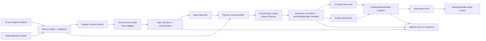

# Video Visual Report V1-A — System Design

## Design drivers

1. Content planning, not rendering, is the active product uncertainty.
2. Coverage and editorial compression optimize different objectives and remain
   separate model calls.
3. Models select semantic content and existing source IDs; deterministic code
   owns identity, timestamps, validation, budgets, and renderer compatibility.
4. Every failure and deterministic normalization remains visible; no generated
   semantic repair may obscure model quality.
5. Existing V0 renderer and frozen P0-B inputs remain isolated and unchanged.

## Context and trust boundary



The local process is trusted to validate source/config and hold credentials.
Transcript and provider output are untrusted data. The provider receives the
authorized transcript and task contract but no secret, local path, media, tool,
or execution authority.

## Task 009 network-recovery overlay

Task 009 adds no component or alternate provider path. It runs the existing
single-video pipeline with the Task 008 revision and Kling source snapshot as
read-only inputs. The only transport difference is an inline
`NO_PROXY=api.deepseek.com` and `no_proxy=api.deepseek.com` assignment on the
one `uv` child process. The global proxy, shell profile, `.env`, product code,
dependencies, runtime data, and infrastructure remain outside this
documentation session's change boundary.

The new run directory is marked `diagnostic_only=true` and remains outside the
Task 008 product set. `run.json` remains the sole execution-state authority;
the task terminal is a separate review label. A successful `RENDERED` artifact
therefore proves only that this one frozen path completed under the process
override. It does not open the Web gate, create a product denominator, or
authorize any other video.

## Components and responsibilities

| Component | Responsibility | Must not do |
|---|---|---|
| Source loader | Reuse `VideoSegment`/manifest validation; enforce size and rights metadata | Rewrite or resegment frozen transcript |
| Run recorder | Create unique directory; snapshot non-secret config; record state/calls/failures | Overwrite another run or hide failure |
| Mapper context builder | Serialize complete ordered transcript plus Mapper schema/policy | Retrieve, rank, truncate silently, or add outside facts |
| Model adapter | Execute the stage call, own the run's single eligible identical technical retry, and capture attempt/usage/latency/raw output | Retry semantic failures, exceed one retry per run, fall back, call tools, or choose an implicit model |
| Topic Resolver | Validate shallow semantic proposal, resolve usable spans/IDs, generate IDs/times, and report overlap/uncovered segments | Rewrite summaries, fabricate evidence, or force exact segment partition |
| Planner context builder | Provide full transcript, canonical Topic Map, renderer grammar/budgets | Remove mapped topics before model sees them |
| Plan normalizer/compiler | Bind/validate shallow content units, choose compatible current typed blocks, omit whole unusable units visibly, and generate current V0 plan plus empty assets | Rewrite, merge, split, truncate, or synthesize semantic content; modify renderer layout |
| V0 renderer | Render the compiled current plan | Call a model or interpret missing fields |
| Prototype reviewer | Aggregate diagnostics, content/visual rubrics, structure comparison and screenshots across all three reports | Treat schema-first-hit as product acceptance, self-score Owner rubrics, or hide retries/failures |

Names are logical responsibilities, not a mandate for one file per row.

## Main synchronous flow

1. Reject an existing run ID and create `run.json` in state `CREATED`.
2. Load manifest/segments; validate video identity, temporal invariants, size,
   explicit provider/model, and credential presence.
3. Make the Topic Mapper call with the entire ordered transcript. If it ends in
   an eligible technical category and the run retry budget is unused, retain
   attempt 1 and repeat the identical request once.
4. Persist raw output; normalize valid topic spans/representative IDs, bind
   exact refs, record overlap/uncovered/repair diagnostics, and write
   `topic-map.json`.
5. Make the Report Planner call with the same transcript, canonical Topic Map,
   block affordances, and budgets. The same single run-level technical retry
   rule applies only when it was not spent during mapping.
6. Persist raw output and an ordered normalization ledger; bind source IDs and
   structurally map complete supplied shapes without rewriting, merging,
   splitting, truncating, or synthesizing semantics; compile deterministic
   IDs/timestamps/metadata into the current V0 plan.
7. Write the current empty asset manifest and call the existing renderer.
8. Confirm two base calls or two base calls plus one eligible retry, complete
   artifacts, and mark `RENDERED`.
9. Capture 1080 px desktop and approximately 390 px mobile views. Product
   review later assesses all three reports; runtime never self-accepts quality.

## Authority map

| Concept | Canonical authority | Derived representation | Conflict rule |
|---|---|---|---|
| Transcript text/IDs/times | Existing `segments.jsonl` | Model context, source refs | Source artifact wins; v2 removes unknown proposal IDs with evidence and never emits them as refs; no usable source fails |
| Video metadata/rights | Existing ingest/corpus manifest | Report metadata/run manifest | Manifest wins; model cannot author it |
| Topic coverage | Valid canonical `topic-map.json` | Planner context | Binder result wins; raw proposal is diagnostic |
| Report semantics/order | Valid compiled `report-plan.json` | Rendered DOM | Compiled plan wins; do not hand-edit HTML |
| Layout/style | Existing renderer source | HTML/CSS | Renderer wins; model fields rejected |
| Run status | Run-local `run.json` | Artifact existence/stdout | Status guard wins; files alone do not imply success |
| Product-prototype conclusion | Owner-reviewed product-set package: three reports on the normal path, or an exact classified missing-output terminal | Per-run diagnostics/rubrics/screenshots | Owner decision wins; renderer or schema success is insufficient; technical and semantic insufficiency remain distinct |

## Model and deterministic responsibility

| Decision | Topic Mapper | Report Planner | Deterministic code |
|---|---|---|---|
| What the transcript covers | Proposes ordered approximate topic spans and representative evidence | Reads only | Resolves spans, reports overlap/uncovered segments, binds times |
| What to emphasize/omit | Prohibited | Proposes selection/order | Computes unselected topic diagnostics; does not require exact model disposition |
| Narrative/section/block type | Prohibited | Proposes semantic structure and advisory block hints | Chooses compatible typed block and enforces closed V0 grammar/budgets |
| Adaptive report size | Prohibited | Receives and uses a soft recommendation; may deviate for grounded editorial quality | Computes the versioned recommendation from manifest duration/canonical primary topics, records diagnostics, and enforces only aggregate hard ceilings plus unchanged V0 rules |
| Claim wording | Topic summaries only | Report copy | Validates refs/metrics; never rewrites |
| IDs/timestamps/metadata | Prohibited | Prohibited | Sole authority |
| HTML/CSS/SVG/layout | Prohibited | Prohibited | Existing renderer only |

## Technology and framework choices

- Existing Python/Pydantic/uv contracts are fixed by the repository.
- The already-installed OpenAI SDK remains the provider boundary; the exact
  configured text model is explicit per run and Owner-confirmed as an
  implementation-delegated choice within context/JSON/quality constraints.
- Framework status is `NOT_APPLICABLE`; two sequential calls plus deterministic
  validators do not justify an Agent framework, workflow engine, or Hypha.
- The completed provider-conformance continuation used native schema output and
  ended in no-go. The later official-OpenAI isolation proposal is cancelled.
- The current v2 product prototype uses one frozen existing DeepSeek Chat
  Completions JSON-object tuple. JSON validity is a transport envelope, not the
  canonical product contract; project-owned normalizer/compiler validation
  remains authoritative.

## Rejected alternatives

| Alternative | Reason rejected for V1-A |
|---|---|
| One transcript-to-plan prompt | Merges coverage and selection, hiding omissions |
| LLM repair/third semantic stage | Adds unbounded generative repair and obscures the two-role product design; the one identical technical retry is transport recovery, not semantic repair |
| Strict provider schema as product goal | Repeated DeepSeek runs showed that provider conformance can dominate the content hypothesis; v2 measures semantic proposal plus deterministic governance instead |
| Hidden or generative repair | Can fabricate meaning or make model quality unmeasurable; only enumerated non-semantic governance with a ledger is allowed, with no semantic rewrite/merge/split |
| Model timestamps/coordinates/HTML | Inventable and outside semantic authority |
| Chunk-and-merge Mapper | Not required by current 18–26k-character fixtures; adds more calls and synthesis risk |
| RAG/retrieval over transcript | Full authorized input fits the bounded envelope and coverage is the goal |
| Agent/LangGraph/Hypha | No tools, memory, branching autonomy, or durable workflow need |
| V0 schema/renderer redesign | Renderer route is already accepted; V1-A must test planning |

## Execution, scaling, and backpressure

One foreground run executes one video, two sequential semantic stages, and at
most one identical technical retry, for at most three provider calls.
No queue, cache, background worker, concurrency controller, or backpressure layer
is introduced. An input outside the 80-segment/50,000-character envelope fails;
V1-A does not silently chunk it. A later observed need may authorize a separate
design change.

The adaptive-budget change adds no service or orchestration node. A small
deterministic budget builder runs after Topic Resolver and before Planner:

```text
validated manifest + canonical Topic Map
  -> planning-budget.json / Planner planning_budget payload
  -> semantic Planner proposal
  -> non-semantic compiler + budget diagnostics
  -> unchanged V0 plan validation and renderer
```

The recommendation is frozen input to Planner; the hard check is deterministic
output validation. The builder/validator never calls a model and cannot repair
semantic content.

For Task 009, the same two semantic stages remain sequential. The process
override is applied before the first stage and is recorded as non-secret
diagnostic metadata. The run owns the existing one eligible identical retry,
for a maximum of three provider/model calls; no second execution path is
introduced.

## Failure isolation and recovery

- The unique run directory isolates every success, failure, and cancellation.
- Planner is never called when Topic Resolver produces no usable canonical topic.
- Renderer is never called when normalization leaves fewer than three grounded
  content units or final V0 validation fails.
- Raw provider output and normalization ledger are retained; neither raw nor
  normalized proposal is the final V0 authority.
- Failure never overwrites a prior run or frozen source/V0 artifact.
- An eligible API/JSON anomaly may use the one attempt-recorded identical retry.
  All semantic/product failures are non-retryable inside the run. A later
  prompt/model/policy change requires new Owner authority and a new complete
  three-video product set.

## Configuration, secrets, release, rollback, and restore

- Configuration: explicit environment names plus versioned prompt/schema policy.
- Secrets: environment-only; traces record only credential presence.
- Release: not applicable. V1-A ends at Owner review of three local product
  reports and their desktop/mobile evidence.
- Rollback: revert V1-A-specific code/docs and retain or delete local run roots;
  current `render` command and V0 schema remain compatible.
- Backup/restore: no service requirement. Version control protects code/docs;
  runs can be reproduced while source/provider/model remain available.
